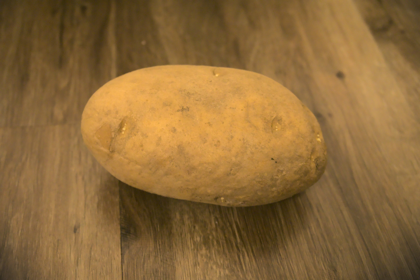

Potatoes have found their way into every facet of modern life. 100 years ago, a typical person would have seen a potato only a handful of times in their whole life. Nowadays, you can hardly turn on the TV without facing a barrage of potato-related imagery. From french fries to potato chips, potatoes are sweeping the nation. I decided to take a trip to my local neighborhood grocery store, Costco, to taste the 'taters myself.

Potatoes are not a one-size-fits-all vegetable. In a single trip to the store you could be walking out with potatoes that are red, gold, brown, or even yellow! Add on top of that the different potato shapes, including but not limited to spherical, ellipsoid, and blob. And good luck buying just one! Given the popularity of the tubers, you will want to stock up as much as you can; I recommend the 15 pound bag if you can find it. The variations on potato are too much to name and could occupy a life-long research career, so here the focus will be on the big three: Yukon Gold, Russet, and King Edward. These are the classics, though there are some new spuds on the scene that are worth keeping a close eye on, such as the [Adirondack Blue](https://en.wikipedia.org/wiki/Adirondack_Blue) or [Creamer Potatoes](https://www.littlepotatoes.com/whats-a-creamer/).

{{}}

## Potato Background

Potato breeding is a contentious industry. Only a select few can handle the long hours in the lab, the constant failure, and the ever-present starchiness of potato procreation. Hoity-toity scientists call them *Solanum tuberosum L.*, but to us lowers you can simply refer to them as 'taters and everyone will know what you mean. Potatoes hail from the Andes, and are relatively new on the culinary scene. For all his feats, Caesar could have never eaten a french fry or seen the potato from the record for World's Heaviest Potato.

Potatoes are especially tricky to breed due in large part to their 4x1 chromosome scheme: they have 12 chromosomes each copied four times for a total of 48, making them a tetraploid. A more normal amount of chromosomes would be around 2x2, or two pairs of each 23 chromosomes, give or take a few. It was long thought that a viable potato with only two copies of its chromosomes was a pipe dream. They always wound up runty and lumpy! But thanks to modern technology, thick and bulky diploid potatoes may be on the horizon. 

Potatoes do produce true seeds with varying characteristics if you nudge them the right way, but they are also often grown from asexual offshoots of a parent plant. But before you go burying your Costco bag of potatoes in the hopes of some brown gold, there are some trifles to be aware of. For one, consumer-level potatoes are often treated so that the eyes (or "sprouts") will not form as readily, even when placed in ideal growing conditions. The potato itself has something to say about this too! They will lay dormant unless coaxed into action, through a combination of light, humidity and temperature.

Deep in the bowels of a potato, the starches come out to play. A single starch combines two sugar molecules: amylose and amylopectin, usually in a similar ratio of 1:3, respectively (though some "whacky" foods like [Waxy Corn](https://en.wikipedia.org/wiki/Waxy_corn) don't have any amylose, watch out for those!). The flimsy starch granules are dissolved during cooking, but can reform into a gel when cooled, so watch out!

## Potato Breakdown

There are many potato varieties out there. They all count as the same species, but are different cultivars.

### Yukon Gold

Despite the name, these tubers are from Ontario. I guess they added "Yukon" to make them sound more rustic and appeal more readily to the common person. Yukon Golds were purposefully produced in a lab in the 1960s by a Canada-native man nicknamed Gary after being inspired by a yellow potato from South America. While these potatoes are nice and smooth, their trademark is their sleepiness: thanks to their long dormancy phase they rarely sprout eyes. Snag a couple of these if you're after some potatoes you can leave in the pantry and forget about while you're off doing your hobbies.

### Russet

Known for their impressive length and considerable girth, Russets are used the world over for everyday dishes such as McDonald's fries and grandma's mashed potatoes. Less creative than the Yukon, russet potatoes are named after the color, which itself is named after russet, a [type of cloth](https://en.wikipedia.org/wiki/Russet_(cloth)) made with wool, woad, and madder. The astute potato eater will recognize their milquetoast, unoffensive flavor and heft.

### King Edward
There have been 11 English King Edwards, the most notable being either Edward I or Edward III, depending on who you ask, but there is only one King Edward potato, named after the second-to-last Edward, Edward VII. With nary a wrinkle to show its age, these taters have been in production for over a century, with emphasis on their propensity to be mashed or made into gnocchi.

## Potato Conclusion

All these details sure can get confusing! If there's one important takeaway, it's that most potatoes are basically the same and you can use them wherever without a second thought. Second, a large stockpile of potatoes is always wise. The culinary possibilities are nearly limitless, so why not keep some around just in case? Even cooking the potatoes the same way, you can cut them into cubes, prisms, or even potato spheres, giving a whole new dimension to what would otherwise be the same dish. Just make sure to give them a rise first!