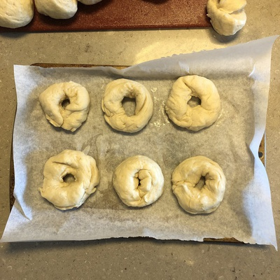
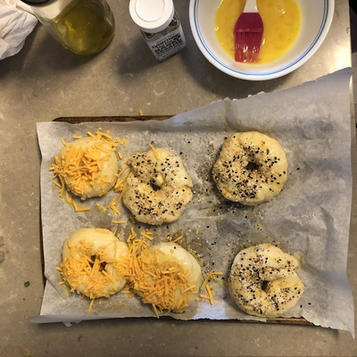

It's been a while but I'm back, and with a bang. I've [previously written](/everything-beans) on some alternative uses for Trader Joe's "Everything but the Bagel Sesame Seasoning Blend," but here today we have a more traditional application. Since the seasoning itself is bagel-less, with the simple addition of some raw bagels you can easily make everything bagels from the comfort of your own kitchen.

To some, an everything bagel seems a little elusive. What is everything? How do they get it? Questions swirl unanswered in even the most brilliant of culinary minds, leading people to believe that everything bagels can only be had from your local bagelery. I have proven by example that this is not the case, and that everything bagels are within the reach of the layman.

Immediately proving my point (after doing some proofing itself!) is the dough, greeting us with a nice firm texture and a malleable and friendly finish. Move over goldfish, there's a new smiling snack in town! But the work here is not quite finished.

{{}}

Bagels commonly take on a toroidal form, though mishaps can turn that into a mere ellipsoid. Despite my careful care to avoid that pitfall, I was not able to achieve a 100% success rate for the dough rings below.

{{}}

Next comes the egg wash and toppings. In my ignorant past, I would get bagels from the local Costco, who sources their bagels from Einstein Bros. Bagels, the Colorado-based bagel company. For the uninitiated, Einstein Bros. Bagels duplicitously [markets](https://www.einsteinbros.com/) itself as "Your Neighborhood Bagel Shop" is a Boston Market spin-off whose holding company has [ties to Adolf Hitler](https://en.wikipedia.org/wiki/Einstein_Bros._Bagels#History). Their top bagels that they stock in Costco are the cheddar cheese bagels and everything bagels. While their cheese bagels are good enough, their everything bagels have one too many things, ruining themselves with fennel. Here I have extracted the good parts of those bagels and lessons learned therein, and left the bad in the dust.

{{}}

As can be seen at the top of this page, the bagels turned out much like members of the human race, with some as glistening examples of what can be achieved while others are wrought with malformities. But on the inside, these bagels are moist and chewy, ready for a nice lather of cream cheese. After an extra trip through the toaster, you'd be hard-pressed to find better bagels outside of a specialty shop. These bagels are "right on."