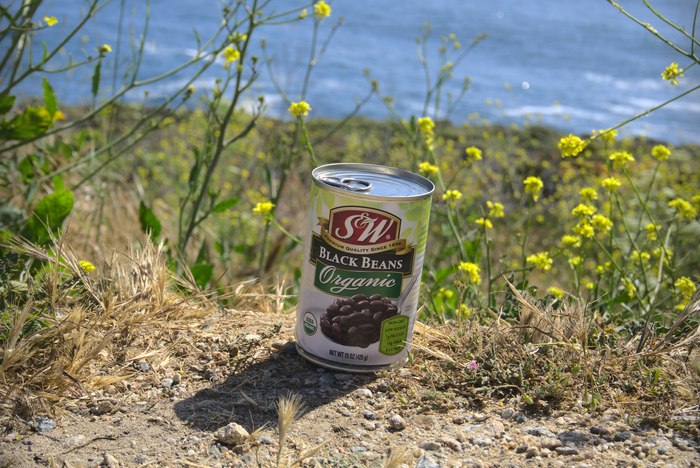
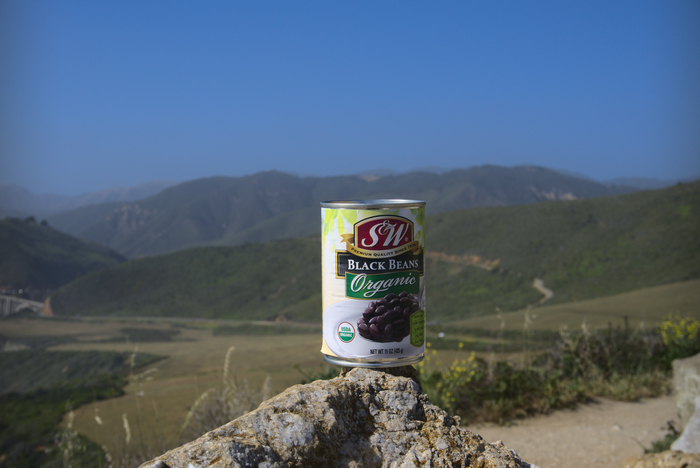
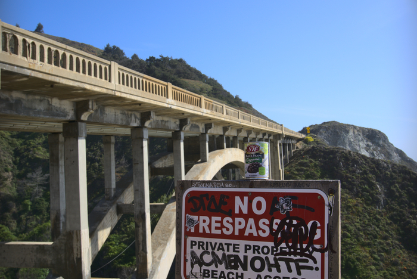
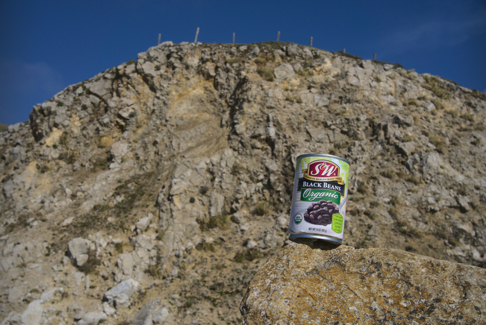
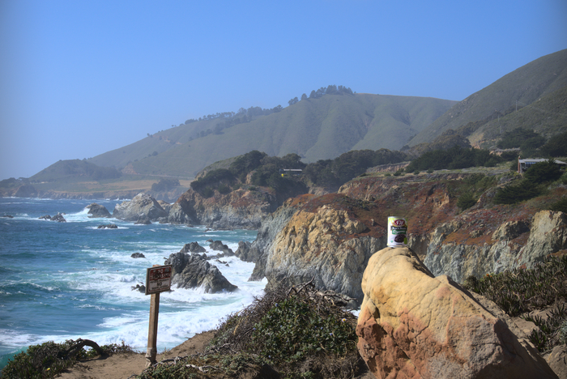
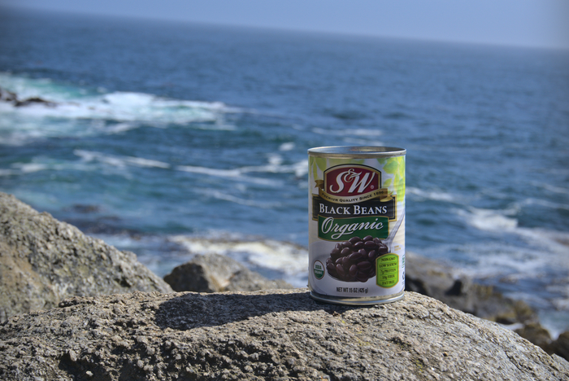
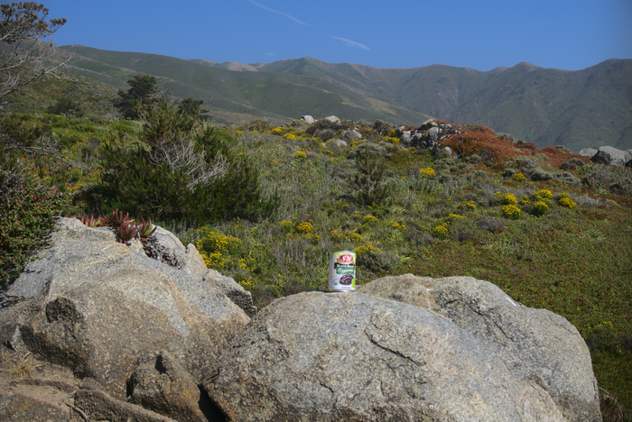
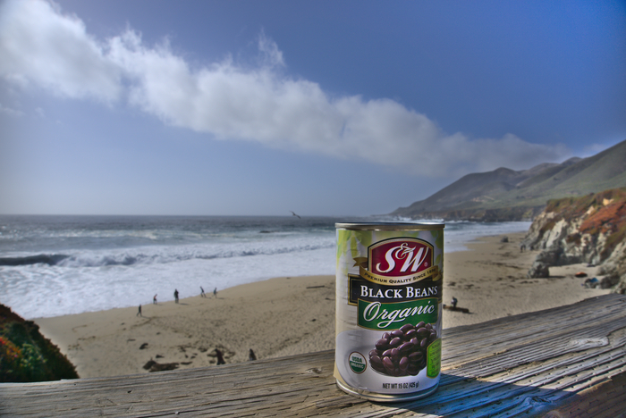

Every bean has a simple dream: to grow and mature in the sweet sunshine of mother nature, be picked by a Ploeger BP2140E self-propelled bean picker, shucked, cooked, canned in a pool of their own juice, packaged in a group of eight, shipped to a Costco, sold to a scrupulous consumer, microwaved for one minute, salted, and eaten from a bowl. But like many things in this is not every bean's destiny. Faribault Foods, Inc., the proprietor of the S&W brand black beans sold at Costcos around the nation [published a sweeping recall](https://www.fda.gov/safety/recalls-market-withdrawals-safety-alerts/faribault-foods-inc-announces-voluntary-recall-limited-quantity-sw-brand-organic-black-beans-and-o) due to a compromised can seal. The heat didn't stop there, as one month later they [expanded the recall](https://www.fda.gov/safety/recalls-market-withdrawals-safety-alerts/faribault-foods-inc-announces-extension-voluntary-recall-limited-quantity-sw-brand-organic-black) to cover beans expiring in 2022. For all their claims of [leading bean innovation](https://www.faribaultfoods.com/wp-content/uploads/2020/06/heirloom-series-press-release.pdf), they really could use some focus on the fundamentals!

A ruptured seal on a can *can* have disastrous consequences to those who dare to slurp down its contents, primarily botulism caused by [*Clostridium botulinum*](https://en.wikipedia.org/wiki/Clostridium_botulinum). These little buggers aren't harmful in themselves, but they produce a neurotoxin which is very dangerous to nerves. The canning process can prevent the growth of the bacteria by low pH or by canning under high pressure and temperature, but a broken seal means that all bets are off. The toxin itself can be denatured by heating it to boiling temperatures for 20 or so minutes, but it's hard to be sure it's all dealt with.

In the face of this news I was distraught. I have spent years building up my bean shelf, relying on it from anything from a quick snack to a repository of backup food for the next impending apocalypse. I was even planning on whipping up a batch of [bean chili](/bean-chili) this week! It felt wrong to part with my collection so unceremoniously as to dump it all in the garbage bin down by the street. There needed to be something more, to give both of us the closure we need. And what better last hurrah than a bean road trip!



















All good things must come to an end, such is the inevitable march of entropy. And thus, the beans and I had to part ways. I'd be lying if I said I wasn't feeling a bit empty inside, not in my heart, but a few inches further south if you know what I mean. There's no telling when these unprecedented times will end and life can return to normal, where any old can of beans of the street is trustworthy. It may take years, but I've got nowhere else to be.