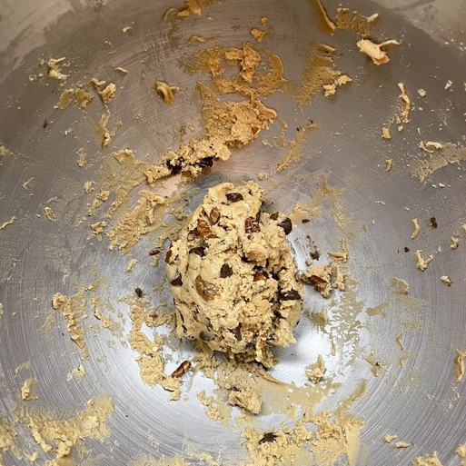
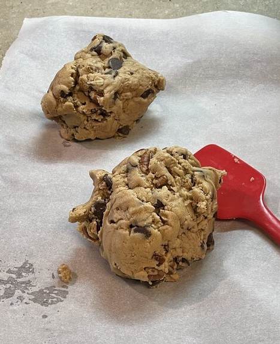

Cookies again! Before you go off thinking I'm slamming down a dozen sticks of butter each week with all these cookie posts, rest assured, there's plenty of broccoli and fresh cans of corn that don't make the cut for a post here. Cakes and cookies have been embroiled in dispute since coming onto the culinary scene hundreds of years ago.

Since cakes are a near cousin of bread, their origin is difficult to trace down. Scholars have been at it for decades but we may never know for sure. One thing that the academics have been able to pin down is the first reference to carrot cake in cookbooks from the early 1800s. But I'm not a huge fan of carrot cake, so this isn't really helpful. It's okay, and sometimes even good when the size of carrot chunks is just right so as to elicit a substantial crunch, but that is rare. Cookies on the other hand have been around as long as baking itself, though for a while they called them "koekjes." It wasn't until the 1700s that bakers started to make them in their modern form with butter and sugar galore.

{{}}

There is a middle ground between cakes and cookies, the cakey-cookie. Just take a look out your window, you'll probably find 3-5 cookie peddlers selling these hot, new desserts. Like a cookie of yore, they are buttery, but unlike those the cake-cookies of today are big enough to justify their $5 price tag at the store. Or so they think! For me, that's just a little too much for some glorified bread. If I'm going to spend $5, it's going to be at Taco Bell.

{{}}

Turns out they're not too hard to make yourself and get just as good as from the store. Just make sure to be liberal with the nut chunks, and you'll be chowing down on some thick delectable cookies before the cows come home.
