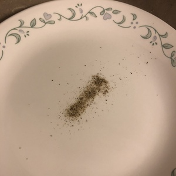
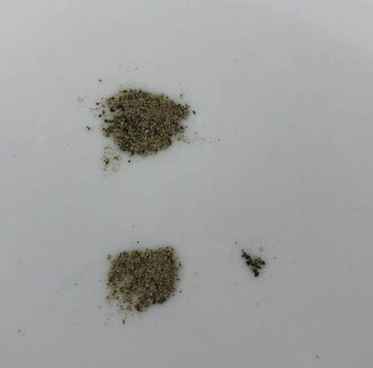

You'd have a tough time finding a kitchen these days without black pepper hiding away in the spice cabinet. Everyone has no trouble flinging salt and pepper every which way on every piece of food that passes over their countertops. But what's under the covers, so to speak? How does a peppercorn stand against a premium peppercorn? What's the big deal with GMO peppercorns anyways?

A lot of folks prefer to have a pepper grinder to grind up fresh peppercorns on demand. I say that's an unnecessary extravagance, and that pre-ground peppercorn is perfectly adequate. Pepper grinders can only dispense pepper in a  meager shower, while the box pictured above has the ability to produce a similar shower, in addition to a more voluminous "pour." And that's not even considering if, God forbid, the grinder gets jammed at an inopportune time. I also shirk fanciful pepper variants, such as lemon pepper. While useful in certain situations, such as on a pair of chicken's wings, in general the lemoniness clashes with other spices.

{{}}



If you're trying to customize your pepper experience, a grinder starts to make more sense. Straight-from-the-shelf, commodity pepper doesn't leave much room for customization. For example, I removed some of the larger black flakes as you can see below, but there is not much difference in taste.

{{}}



From its humble beginnings as a berry on a flowering vine, pepper can be useful in a wide variety of dishes, from eggs to steamed broccoli to steamed peas. In my kitchen, it usually finds itself stopping by near the tail end of the preparation of a group of scrambled eggs. It's not absolutely essential, but it certainly knocks the whole experience up a notch or two. If you're looking for that extra boost to add to your dishes, make sure to keep an eye out for some pepper next time you're in the spice aisle at your local grocery store.

As a good friend of mine always used to say:

Pepper, pepperoni,
Mushroom rigatoni.
You'll be feelin' baloney,
when I win a Tony.

