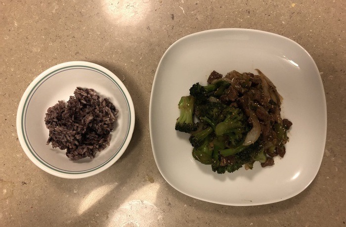

Another [copy-cat](/chessmen) dish, broccoli beef hails from the hallowed halls of [Panda Express](https://www.pandaexpress.com/menu/entrees/broccoli-beef). These days, recreating a fast food dish at home is hardly noteworthy, so there are a few twists and turns waiting to surprise us as we dig into this mound. 

The broccoli beef industry has experienced a boon in recent decades. In addition to [Jimmy Wang's](https://www.linkedin.com/in/jimmy-wang-10a292b6) current iteration of Panda Express Broccoli Beef, P.F. Chang himself has introduced a slight variation, [Beef with Broccoli](https://www.pfchangs.com/menu/beef-with-broccoli). For your average Joe, these dishes may seem out of reach, but thankfully there are also at home options; grocery stores are rife with pre-made broccoli beef sauce mixes, just add the broccoli and the beef! For those fortunate enough to have soy sauce and brown sugar in their pantry, these sauce packs aren't necessary. It's so simple to whip together some broccoli beef sauce, even your cat could do it!

{{}}

The broccoli beef dish appears to wear its heart on its sleeve, with its ingredients and flavors laid bare to the observer. But, as anyone who has eaten a broccoli beef could tell you, there is more going on than meets the eye. At first glance it is easy to miss, but the sesame seeds covering and interspersed in the dish deftly bridge the broccoli and beef flavors into a delightful medley. A slight hint of oyster sauce mixed into the broccoli beef sauce adds an unexpected tangy bite, without which the broccoli would be left bland next to the flavorful beef chunks. A standalone broccoli beef pile can easily overwhelm a fully grown person, so it is essential to pair with with a hearty bowl of rice, any color will do. Once all this is in order, the broccoli beef is ready to be chowed down by anyone and everyone who happens to be nearby.