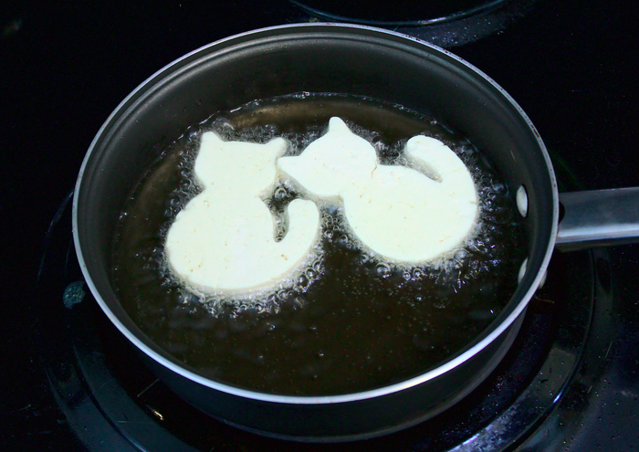
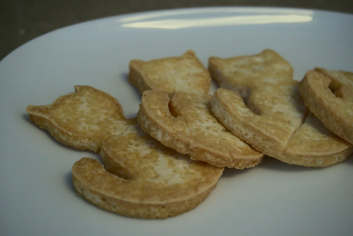

You can hardly walk down a city street without being pelted with cats from every direction these days. The worldwide cat population is in the hundreds of millions. People love cats, and it's only getting stronger as the years go by. And with the recent [DCMTPA](https://en.wikipedia.org/wiki/Dog_and_Cat_Meat_Trade_Prohibition_Act_of_2018), cat shaped foods offer a nice alternative to scratch the itch of having cat themed meals.

The science community has not been able to come to a specific conclusion on whether cats can eat tofu of any shape, much less of their own form. Though soy protein is common in lower tier cat foods, some studies [linked it to higher incidences](https://www.ncbi.nlm.nih.gov/pmc/articles/PMC4967369/) of cat hyperthyroidism. On the other hand, [big cat food](https://www.hillspet.com/pet-care/nutrition-feeding/benefits-of-soy-in-pet-food) advocates for soy protein in cats. A cat without a healthy neck area is a sad cat indeed, so think twice before plopping any slabs of tofu before your local feline.

Regardless, cats can't read so this isn't relevant to them anyways, so let's get down to business. With a firm tofu block in hand, cut it up into half-inch thick slabs, then use your favorite cat shaped cookie cutout tool. This one has a thin tail piece that will achieve a nice crispy crust here in a minute. It can be tempting to try to carve out a cat shape yourself with a small knife, but be careful: not everyone can reproduce a cat in this medium, nor should they. A tofu without some kind of sauce is sadder than the cat from the last paragraph, here it's a simple mixture of soy sauce and "Gochujang." Fry all those up in a pan and you'll be having a _fancy feast_ in no time.



I like to start with the extremities like the tail and ears before working my way to the abdomen where the bulk of the tofu lies. Without a solid crust even a cat tofu can come out soggy and flaccid, but these turned out top notch, I'd rate it four paws out of four!

{{}}
