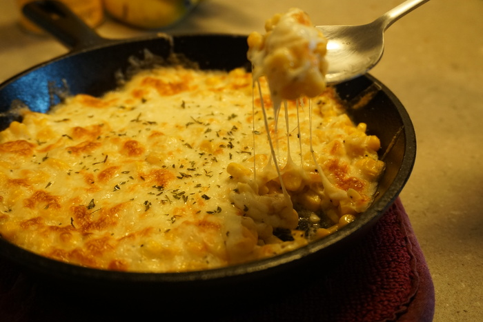

For those that frequent a certain type of ethnic barbeque, cheese corn is a fan favorite. Imagine: cheese and corn mixed together. My mouth is watering already, and we haven't even talked about the mayonnaise! Cheese corn (or "cheesy corn" if you're looking to put a whimsical spin on it) may seem at first glance to be unreachable for the average home cook, but if you dive in and get your hands dirty, you'll find out it's not as complicated as it looks.

It's hard to walk into a grocery store without tripping over 10 or 12 corn cobs, but I find cobs to be a frivolous novelty. The last thing you want when entertaining guests is to have to deal with pesky cobs. Canned corn comes ready to go out of the box, just add cheese! Just kidding, there's a *couple* more steps to it than just cheese. A liberal dusting of mayonaise and some kind of high heat source, like a hair dryer or oven broiler. Mix all of those together and you'll be having a side dish in no time!

{{}}

Technically speaking, it's called [corn cheese](https://en.wikipedia.org/wiki/Corn_cheese), but the corn is clearly the main substrate, not the cheese. The cheese is augmenting the corn, not the other way around. It's like calling sprinkles with ice cream: sure, it has both of those things, but one of them is the clearly the main event. In fact, I could eat just the corn by itself without the cheese or any of the cooking. Heck, you could even leave off the corn and I'd still be having a good time, the corn juice in the can of corn packs a punch all on its own.

When preparing your corn cheese, make sure to keep a close eye on the corn to cheese to mayo ratio. If the corn is too slippery, no one will eat it, buf if it is to dry then the corn may be a choking hazard. You must strike a careful balance, but don't let the pressure get to you, we're all just here to have a good time and eat some corn!
