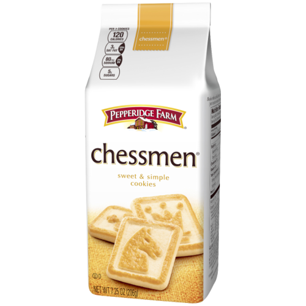
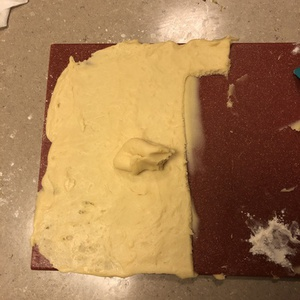
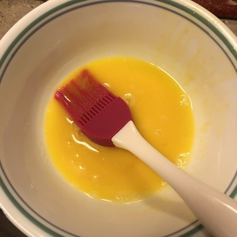

The [Pepperidge Farm Chessmen Butter Cookies](https://www.pepperidgefarm.com/product/chessmen-butter-cookies/) have a rich buttery taste wrapped up in a soft, yet crackery, package. The cookies each have a single chessman (which includes the queen, mind you!) embossed in the center, hence the name. But at nearly $3 a box, who on God's green earth can afford it? The only viable alternative is to whip up a batch at home, using commercial off-the-shelf utensils and appliances. All it takes is some flour, a heaping chunk of butter, and a dash of love, and you can enjoy a passable facsimile in under an hour.

{{}}

The cookies have such a degree of butter that it can easily overload the palate. Therefore they are best consumed one at a time. This also leads the dough to have a slimy and oily consistency, which is something to watch out for when forming the cookies.

{{}}

After shaping the cookies into the requisite squares, an egg was gives them their signature sheen and color contrast. Of course, this only applies if you are brave enough to attempt to emboss the chess pieces onto the cookies. I was not, due to a lack of chess-piece shaped molds in my kitchen.

{{}}

Compared to other styles of cookies, such as chocolate-chip cookies or even a shortbread biscuit, these chessmen cookies seem austere. But inside they hide a secret treasure, butter. The richness of the butter makes an otherwise bare foodstuff into a commendable dessert. Far be it from me to toot my own horn, but these cookies are a check-mate!

