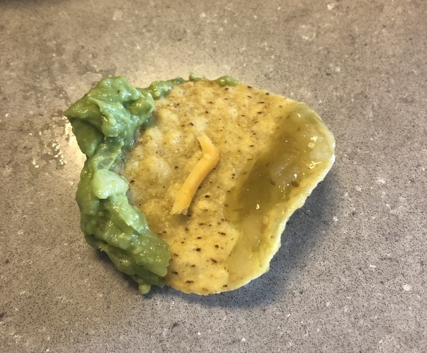

In front of you a bountiful cornucopia overflows with tortilla chips. These chips are so bare and dry, they are practically begging for a dip to quench their thirst. Do you play it safe and go for the salsa verde? Its classic tangy flavors and smells elicit memories of a simpler time. Do you go the more dangerous route and dip into the two-ingredient guacamole? What it lacks in tomatoes it more than makes up for with tongue-twirling liminess. Or, do you leave the chip high and dry, and go for the room temperature cheese dip? The fats and proteins in the cheese can certainly elevate the flavor profile to a new plane, but is it worth the cost?

Not I, nor any man, woman, or child can presume to hold the keys to the questions above. One could spend an entire career, nay, a lifetime, deliberating on these questions and get no closer to an answer. All I can do is try to show something unconventional, something a little outside the box. Such solutions are not meant to confound, but to inspire and spur further innovation. You see, "Chips and Dip" is an outdated concept, unfit for the modern era. The discerning eater of today wants and needs options to customize their meal to their preference. A singular dip collapses the combinatorial explosion of options from indiscernibly large to one, whereas multiple dips leave the field wide open. Just as no two snowflakes are alike, no two dipped chips should be alike. Some may be better than others, but it is this exploration itself that lends itself to a superior eating experience. A chip does not need to be assigned a dip. You may not have even noticed it here, the concept of chips and dip is so ingrained into every person from birth. But, consider the possibilities if you open your mind to chips and dips. They are practically limitless.

{{}}
