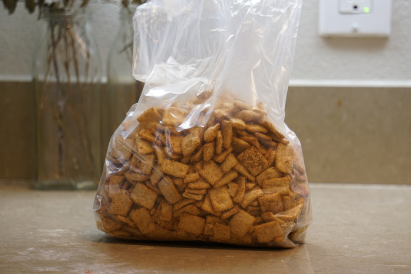

Cinnamon for breakfast? Some think it farfetched, unhealthy, or downright ludicrous! But the success of Cinnamon Toast Crunch, or "CTC" as it is sometimes called, has illuminated the truth: with enough sugar anything can be food. On a roll since the '80s, Cinnamon Toast Crunch takes up several feet of prime shelf space in your average grocery store for itself, both regular and family size, along with its questionable offspring like French Toast Crunch and Cinnamon Toast Crunch: Churros. Trader Joe himself saw this success and attempted to replicate it within his own walled garden, leaving us with [Mr. Coulombe's](https://en.wikipedia.org/wiki/Joe_Coulombe) foremost legacy: Crunchy Cinnamon Squares.

{{}}

These hearty squares are girthier in every dimension than their General Mills counterpart. As a result, the ratio of surface area to volume per square is significantly reduced, leading to less sugary-cinnamon coating per unit volume of square. This may seem undesirable to non-Crunchers, but in fact it offers a relatable but novel way to get a healthy dose of breakfast cinnamon. However, this is all an elaborate illusion played by your senses on the brain. When considered in equal serving sizes, [Crunchy Cinnamon Squares](https://www.traderjoes.com/home/products/pdp/crunchy-cinnamon-squares-057120) and [Cinnamon Toast Crunch](https://www.cinnamontoastcrunch.com/product/cinnamon-toast-crunch/) have the same amount of sugar per ounce, with the Squares edging out the Crunch slightly in the fat category. The only explanation for the sugar discrepancy must be a higher sugar content within the dough used to make the squares themselves.

{{}}
{{}}

Cinnamon and sugar mixed together follow a storied history dating back hundreds of years. While in the past it was primarily used to enhance the flavors of fruit desserts, it has found its way into purely bread based dishes, such as the churro, waffles, snickerdoodle cookies, and the aforementioned cereals. Where will it go next? Personally I am interested to see if cinnamon sugar sneaks into lunch dishes, such as a salad or hot dogs. Keep your eyes on the lookout in the coming decades!
