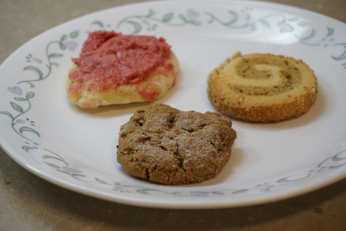

Two eternal rivals finally put face to face in a head-on contest of flavor, texture, and cookedness. Who will win the Christmas cookie showdown? On one side of the ring is half of a Chili's Skillet Cookie. Even with half of its mass lost, it packs over 500 calories and 50 grams of fat, not counting the scoop of ice cream included on the side! On the other is an unruly bunch of misfits, three cookies of a larger eclectic batch come together. Can they stand up against the years of research put into the Chili's Skillet Cookie?

{{}}

The three cookies, hereafter referred to as "The Bunch," come in a variety of textures, shapes, and sizes, much like bobas in a crude milk tea. But unlike my homemade boba, these cookies are largely palatable. The brown one is a little heavy on the ginger for my tastes, but all-in-all a strong showing. And how about that swirl!

The Chili's Skillet Cookie has been through a lot. Shaken up and down and every which way on its long journey home, then left to stand for several days, its resiliency is endearing to even the coldest of hearts. A quick jaunt in the air fryer is all that is needed to restore its vigor, though some hints of the cookie's torrid past still remain. Its friends, the scoop of vanilla ice cream with ice crystals large enough to poke a hole in a pickup's tires and a dollop of fudge that almost certainly came out of a five gallon bag, have gone through their own trials and failed, leaving the cookie to stand on its own.

When it comes to a comparison, the first thing to jump out a prospective consumer is the fat content of the two cookies. The Chili's Skillet Cookie has fat globules at every corner, practically begging for a glass of milk to wash it down. For the lactose intolerant, this is clearly not an option. The Bunch o' Cookies thrives in a much wider set of environments, you could eat them on the go, at home, or anywhere in between. I recommend getting your hands on some if you can, but it can be tough, I only got these because I know a guy!