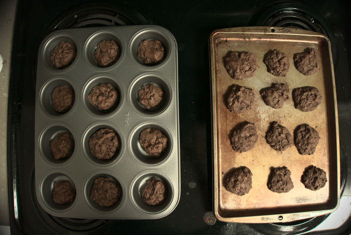
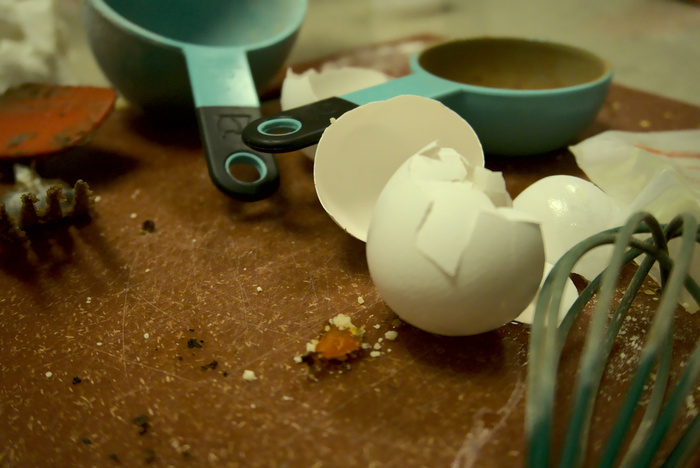

The cookie is a veritable swiss army knife of desserts. Though it provides some playful constraints, these conspire to create a platform that inspires creativity. You will often see cookies formed into a playful and exuberant shape, such as a dinosaur or a christmas tree. These types of changes underscore the wasteful decadence of today's society. For example, a dinosaur cookie with a tail and a body will have clear areas of the cookie where parts are either over or undercooked. The thinness of the tail and the girth of the body can lead to no other conclusion. At this point it should be obvious that cookies should only be formed into circles, since this provides optimal heat distribution among the entire area of the cookie's dough.

{{}}

Now that it is evident that cookies should be a circle, how do you achieve shape them? You can roll the dough into a ball in your hands, but then you've got to deal with all that mess! Not everyone can just wash their hands all willy-nilly. But if you dig around deep enough, everyone has a cupcake or muffin pan sitting somewhere in their house. These unassuming little trays fit our purposes nicely, each hole is a perfect circle that can each accommodate a single cookie. Now a simple spoon can be used to scoop the dough into a rough ball shape, and the cupcake pan does the rest. Compare the results above for your own records.

{{}}

These hearty circles turned out tender and supple, leaving a rich flavor on the palate. A little smaller than your average cookie, they are a perfect snack for the modern on-the-go lifestyle. Simply slip a few in your pockets and pick them out as the day goes by.