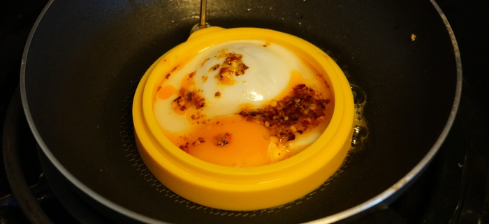
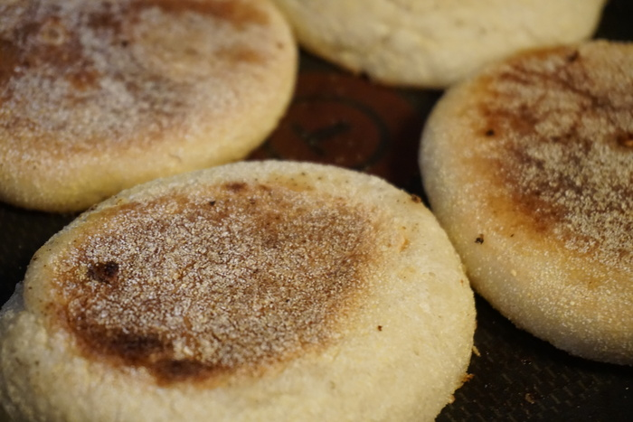

MacDonald's Hamburger Restaurants are sweeping the nation, with a new one popping up on the street corner every week it seems. The inside may seem flashy, but once you look past the crusty exterior all you find are sticky floors and a play pit that's not fit for a hamster. They make a mean Egg McMuffin, though! If only it were possible to recreate such a delectable dish without going outside. Spoiler alert! It is, see the picture above.

Eggs are naturally round, homeomorphic with an ordinary sphere. It follows naturally that cooked eggs should maintain some hint of roundness, but this isn't easily achievable with a pan over a certain size, maybe a few inches in diameter. Without round fried eggs, the dream of an egg, cheese, and English muffin sandwich will always escape our grasp. Recent advances in technology have enabled the roundening of eggs without requiring thousands of pounds of expensive manufacturing equipment. All we need is a simple ring! That's not exactly true, since the muffin is nearly 50% of an egg muffin sandwich. Though barely English and hardly a muffin, the extra-leavened bread complements the egg much like an ice cold root beer on a hot summer day.

{{}}

Parts gathered and eggs cooked, only assembly remains. The easiest step, even a monkey or perhaps a well-intentioned dog could pull it off. The key lies with the cheese, placed at the optimal time to absorb enough heat from the egg to melt just slightly while still retaining its signature "square" shape. If your cheese is sweating, then it's time to eat! A seasoned guzzler can slam down an egg muffin sandwich comfortably in three bites only. Make sure to leave a comment with how many bites it takes you!

{{}}
