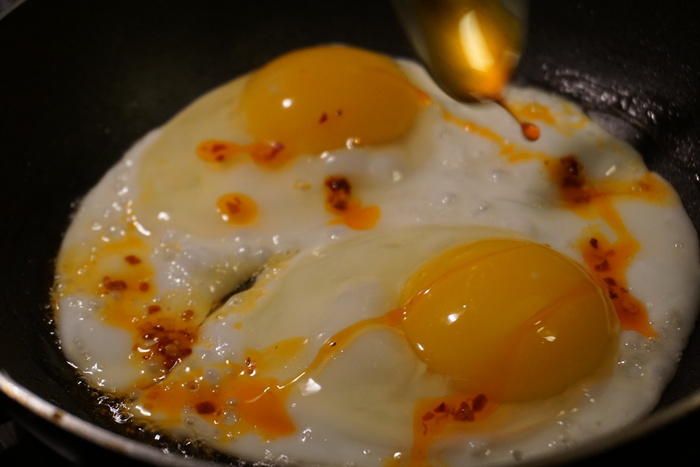

"Leggo my eggo" rings out from elementary school cafeterias to auto-playing TVs in a Walmart electronics section. But where are the eggs? Aside from the "breakfast for dinner" trend, it's all pancakes and waffles and stuffed pancake bites. Kids these days don't even know what an egg looks like. That's no way for the next generation to grow up!

The first time I saw an egg I was just seven months shy of by sixth birthday. It glistened with the blissful ignorance of days gone by as it rolled around the counter top, leaving a trail of hazy juice in its wake. The parent hen clearly put in a strong effort on this egg, evidenced by its pristine curve and rotational symmetry. Back in those days it would take me three, maybe even four bites to gobble down a hard-boiled egg; if only that me could see the me that it became, eating eggs by the dozen at a rate of one bite per egg. Boy, that sure would make a great classic movie scene.

{{}}

Not many people know this, but the breadth of possible preparations is the egg's greatest strength in the kitchen. Stick it on some chicken or fry it in the microwave, anything goes. Heck, you can even put it in your cream for a fancy dessert! If you really want to take your eggs to the next level, you have to give them an infusion or "flavor blast" with the help of your favorite sauce flavors. Boil up your egg and plop it in there for a while and you'll be amazed at what comes out!

The egg shape has fascinated scientists for centuries, baffling them to such a degree that they could come up with no better name than "egg shape." On a two-axis spectrum, each egg can be sorted by degree of ellipse and asymmetry around the ends, but no two eggs are alike! Though it is confusing, you should still always remember to compost your egg shells, no matter the shape. The ostrich lays the largest eggs on average, with eggs ranging up to 8 pounds! Fun fact about ostriches, unlike chickens and other small birds they have no crop in their digestive system. Their photos must have awful composition!
