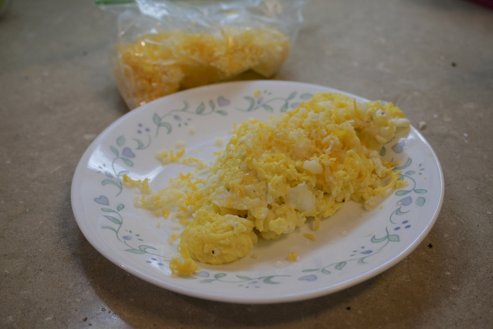

A standard unmodded chicken lays a couple hundred eggs per year, with a break in the late fall to take care of some molting business. The [data](https://sentientmedia.org/number-of-chickens-in-the-us/) is [sketchy](https://www.fao.org/livestock-systems/resources/key-facts/en/), but most seem to agree that at least 20 billion chickens are pecking around at any given time. Not all of these hefty birds lay eggs though, a [few million tons](https://www.fao.org/3/cb4479en/cb4479en.pdf) devote themselves to becoming chicken nuggets. The rest pump out [65 million tons of eggs](https://www.fao.org/3/i6421e/i6421e.pdf) a year; sounds like a lot of eggs to me, just think of all the cholesterol! Just kidding, [think again!](https://en.wikipedia.org/wiki/Egg_as_food#Cardiovascular_risk) Some recent [findings](https://www.mayoclinic.org/diseases-conditions/high-blood-cholesterol/expert-answers/cholesterol/faq-20058468) cast doubt on the conventional thought linking eggs and heart health, as long as you keep to a reasonable 7 eggs a week.

While a non-over-hard fried egg adds a classy look to a hamburger or an avocado toast, they quickly become a mess as their yolk juice floods the containing dish. A careful scrambling is all it takes to avoid such a sticky situation! The secret to a classic scramble lies in the technique, whereas the ingredients are relatively forgiving. Keep those eggs moving for the entire cooking time and you'll end up with a delicious airy egg mush. Add some spinach for a splash of color!



When it comes to toppings, the chunkier the salt the better. Ideally eggs would be served alongside some kind of salt lick so they could be seasoned by the user at will. Practicalities make this an issue, such as the longevity and expense of such a mineral block. In the past uniform and regular salt crystals held renown the world over, but modern society has gone and flipped that on its head! Nothing screams quality like a hearty sea salt flake finish atop your freshly minted scrambled eggs. Add some parsley for a splash of color!
