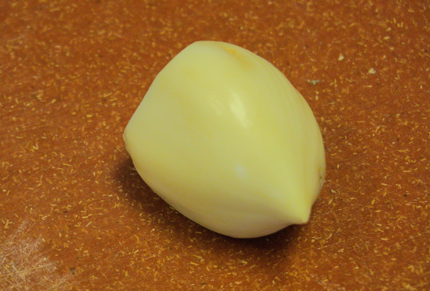
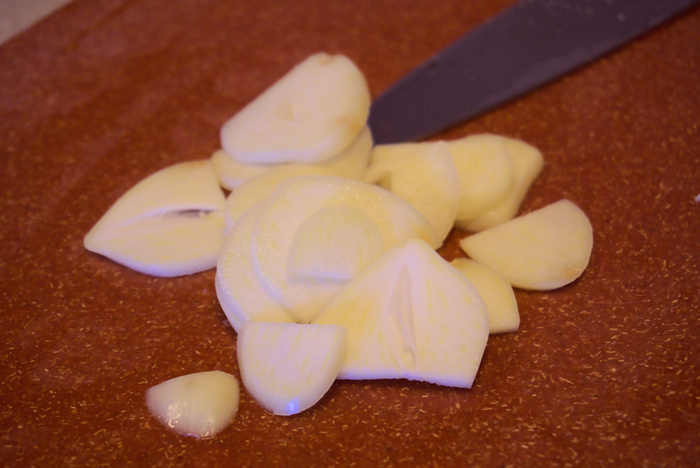

Nothing says "me-yow" better than a pop of garlic flavor in a dish. But mincing, pressing, and dicing leads you to a fresh headache faster than you can say "Oh my, what a pleasant meal." Of course the pre-peeled or even pre-minced garlic from the store will do, and even comes with a fun jar that you can use to hold a strawberry or two, but sitting around in their packages takes off the signature edge that is the whole reason the garlic was sought in the first place.

{{}}

A regular garlic clove's main pitfall lies in the size: it's too darn small! The elephant garlic solves this problem handily, since it is not as small. When chopping up one of these babies, you'd be well within reason to mistake the experience for dicing a shallot!

{{}}

Elephants vary in size pretty wildly, but the largest is the African bush elephant, clocking in around 12,000 lbs for the males. If we consider this to be analogous to the elephant garlic, which I estimate to be about 10 times bigger in volume than a regular garlic clove, that would put the regular garlic in the neighborhood of a female atlantic walrus (around 1,200 lbs). Some empirical evidence suggests that the radio between the two types of garlic by mass is roughly 8:1 (48 grams for the elephant to 6 grams for the regular), weight on par with a California deermouse. But since regular garlic has no name the "elephant" moniker effectively communicates that it is, in fact, bigger (or "elephant-sized") compared to a regular garlic.
