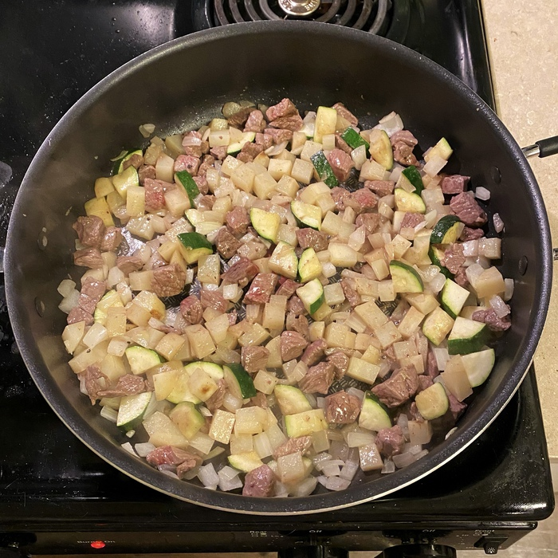

Things are really starting to get cooking over here at [whatscookin.biz](whatscookin.biz)! Today we have an exciting guest post from one of the foremost chefs in the area. Enjoy!

Jjajangmyeon, or black bean noodles for the uninitiated, is a classic crowd-pleaser among enjoyers of Korean cuisine. A Chinese-Korean fusion dish, it originates from Chinese immigrants in Korea's first Chinatown. Its first appearance in Korea dating back to the early 1900s, its heartiness and economical character allowed it to withstand the tests of time to be the culinary goliath that is is now. Today, it is a popular dish among all Koreans, as common a delivery food in Korea as pizza is in America.

Jjajangmyeon consists of two main components -- the sauce and the noodles. "Jjajang" refers to the sauce derived from fried fermented bean paste, and "myeon" translates literally to "noodles." The intense brown color of the sauce may seem daunting to first-timers, but rest assured that it is not poop. The flavor it boasts is deeply savory and rich in umami, lightly reminiscent of soy sauce. The noodles used in this dish are of a thicker cut, typically made with flour, salt, and water. At reputable restaurants in Korea, diners can often gaze upon chefs kneading and pulling the noodles by hand. The noodles are just a touch tacky, making them the perfect vessel for the rich jjajang.

The preparation is simple enough for any layman. Traditional ingredients in the sauce include minced onion, zucchini, cabbage, potatoes, and meat (typically pork, but beef is a perfectly acceptable alternative). Using seafood as the main meat is also a popular variation.

{{}}

Once the vegetables and meat are sauted in oil, simply add some water along with the jjajang to create the sauce. The jjajang is quite thick, so a little elbow grease may be required to evenly disperse the sauce throughout the water. At this point, the sauce can simmered uncovered until the ingredients and the sauce reach the desired texture and thickness. It is common to add a tad of starch slurry to help thicken the sauce as well.

<video width="100%" autoplay loop muted playsinline class="video-background ">
  <source src="output.mp4" type="video/mp4">
</video>

The sauce can then be served over fresh noodles, garnished with sesame seeds and thinly sliced cucumbers (if available). Finally, before digging in, be sure to maintain a firm grasp on to your seat, because this dish is going to blast you to Flavortown!