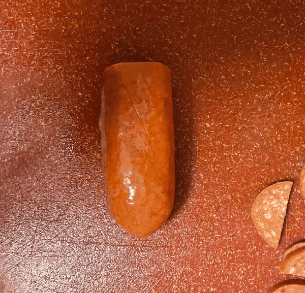

Every child dreams of waking up on Christmas morning to a nice hearty bowl of mac and cheese. Unfortunately, a garden-variety boxed mac and cheese doesn't have anywhere near the protein levels that a growing boy or girl needs, so it's time to improvise. A nice and hearty sausage fills the protein Recommended Dietary Allowance to the brim and beyond, all the while providing a subtle yet rich dimension to an otherwise unremarkable mac and cheese.

{{}}

Plenty of mac and cheese food trucks try to gussy up offerings with toppings like breadcrumbs or pulled pork or cheetos, whatever else they have on hand, but once you pass this superficial layer you're left with the same boring old mac and cheese. Once you realize this, it is clear that mac and cheese is practically crying out for some interstitial sausages.

Sausages these days come in a variety of casings, especially for hog-based sausages, but it is common for them to have a little "nub" at the end where the casing is tied off. I don't want too much collagen to find its way into my 'cheese, so I always make sure to cut those off. But other than that, it's pretty free form: cut the sausages into halves, circles, cubes, whatever your heart desires. Personally, I find the density optimal with half circles, roughly four millimeters in depth.

This type of dish is a little cumbersome on the go, but it's perfect for a quick and easy meal replacement or midnight snack. The only thing really missing is some greenery, but that is easily fixed by pairing the MACAS with a light serving of lettuce. The basis for this instance was the Trader Joe's brand mac and cheese (the Wisconsin variety) which doesn't quite have the same creamy richness as your grandmother's Kraft boxed mac and cheese, but it will do nicely in a pinch if you have no other options. Just stay away from Annie's brand mac and cheese! In my *humble* opinion, it's nothing but an overpriced, watery knockoff! Once I'm able to get my finances in order, the next mac and cheese venture on my list will be to sample the esoteric offerings at Whole Foods, so stay tuned!
