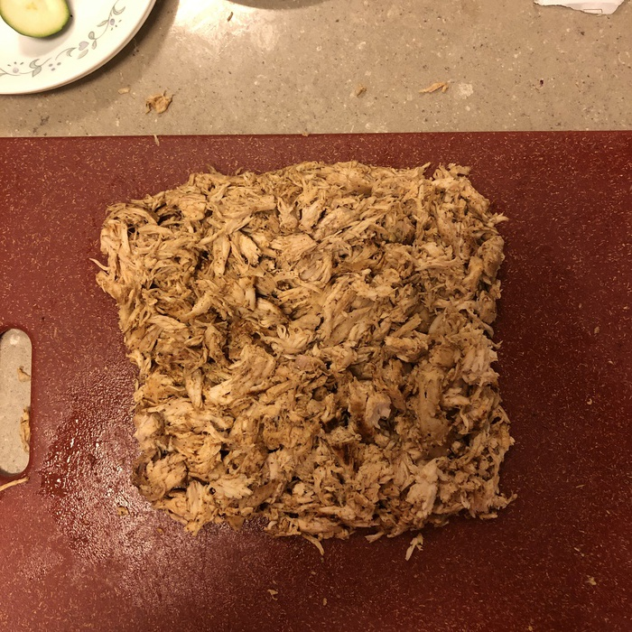
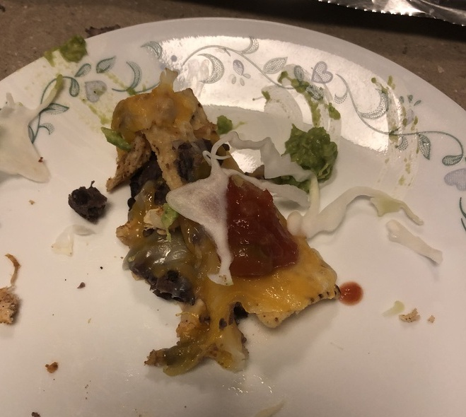

The fabled "Montaña de los Nachos," or, as you may know it, the "Nacho Mountain," is a common delicacy enjoyed throughout the Americas. The ingredients vary, but pictured above is a basic, unoffensive mountain consisting of beans, cheese, shredded chicken, and strip-shaped tortilla chips. Rest assured, various cold toppings such as lettuce, guacamole, and salsa were also present, but were not available for pictures.

{{}}

The nacho mountain above may seem simple to the untrained eye, but there is more going on if you dig below the surface. Perhaps first you will notice that the beans are not the typical beans you get out of a can. Rather, they have been processed into a sort of bean paste that allows for easier distribution and better adhesion to the chips. Next, notice the chips themselves. Not triangles, but strips. This may be upsetting to some, but the strips are far better for a nacho mountain than a standard triangular tortilla chip. A chip in a nacho mountain undergoes many stresses from the weight of the ingredients and the strain from breaking the cheese bonds that hold the chips together. A triangular chip is highly susceptible to breakage at the corners, whereas a strip-shaped chip does not have such a weakness. In the general sense, smaller the angles of the corners in a chip, the worse it would be in a nacho mountain. Three is the absolute minimum, and, not surprisingly, the worse. In the limit we achieve the round tortilla chip, one with no corners. This would be the strongest chip and best for a nacho mountain, but unfortunately none were available when this one was made.

Structure aside, a typical blunder for an amateur nacho mountaineer is adding too many ingredients. It is an easy trap to fall into; it's supposed to be a mountain, after all. But each flavor interacts with other flavors, and the combinatorial explosion of flavor relationships can quickly bog down a dish. For this mountain, only the base ingredients are present, with the others added at the user's pleasure. In this fashion, users can add variety to their meal on demand, rather than searching through the mountain for the chip that just so happens to have the toppings they are craving. For example, check out this delectable bite!

{{}}

The treacherous undertaking of the nacho mountain is highly rewarded for the select few who can execute it well. Here we have seen some of the common pitfalls and how they were avoided for this particular instance. Don't be afraid to give it a try yourself!
