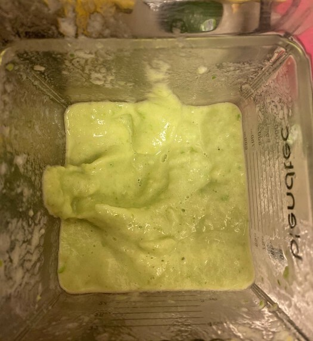

Frozen peas can work wonders for your health, but I'm going to vomit if I have to eat another bowl of steamed peas! Alas, there is another solution: that's right, put them in a smoothie!

Smoothies can be a great way to eat fruits, vegetables, and get your daily dose of water, all at the same time! The cost of a blender turns off many a potential smoothier, but the initial investment will give tenfold returns in a short time. You must be careful with your blender and take good care of it. If it is not a happy camper, your smoothies will come out chunky and flaccid. Your blender wants to be blending plain old water, and it could do that all day if it needed to. But you want it to blend up something much harder, frozen fruits and veggies. So a gentle compromise must be reached, a balance between frozen ingredients and liquid. You may try to get the better end of the deal by feeding your blender liquids a little bit at a time, waiting until the poor blender begs for more before doling it out. This is not a good way to proceed, since it both wastes your time and hurts your blender. So be liberal with the liquids, and everyone involved will have a good time.

{{}}

Peas are finding their ways into everything these days, even hamburgers and cat food. In a smoothie, they add a hefty body and a smooth mouthfeel. With all that liquid discussed above, you have to put something in the smoothie to thicken it up, or it's practically juice! Peas fill this purpose out nicely. Here they are complemented with a small banana of the Cavendish breed.

While the straw in the image at the top may look at first glance to be a boba straw, it is in fact a regular straw, with an inner diameter too small to fit an average sized boba. A delicate balance of liquids and solids is necessary to ensure optimal flow through the straw, so that the suck of a normal pair of lungs is adequate to comfortably sip the smoothie. This falls naturally from the conversation with the blender described in paragraph one.

When it comes to smoothies, trust your instincts and don't be stingy, and delicious drinks will follow!