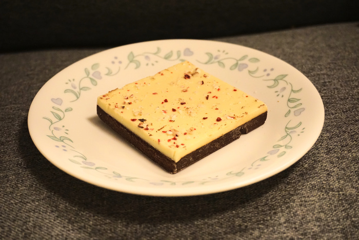
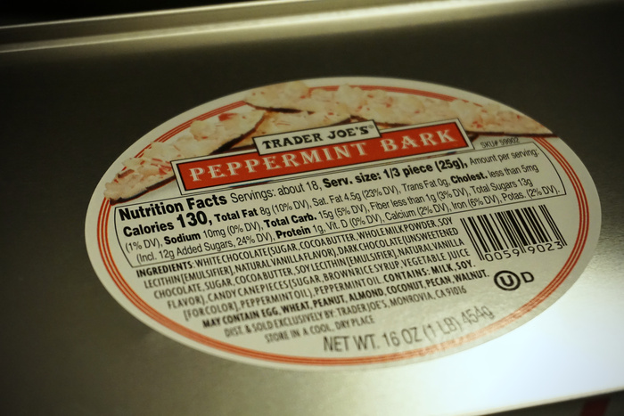

Woof! Whoops, wrong kind of bark! A classic holiday treat, peppermint bark combines three great ingredients, peppermint, white chocolate, and a traditional chocolate (milk or dark). White chocolate can pique some interest by its own nature. During the chocolate-making process, [cocoa solids](https://en.wikipedia.org/wiki/Cocoa_solids) and [cocoa butter](https://en.wikipedia.org/wiki/Cocoa_butter) are separated, but with white chocolate the solids never get added back. That's right, it's just butter! Maybe with some other stuff too (such as palm oil or sweeteners), depending on the manufacturer. Fun fact, the [oleic acid](https://en.wikipedia.org/wiki/Oleic_acid) that makes up over 30% of cocoa butter's fat content is the main component of human body fat! It really does go right to your thighs!

{{}}

While it appears simple from the surface to the core, making peppermint bark at home can be a tricky endeavor at best. The devil lies in the details, specifically here the peppermint shards. Forming chocolate presents little challenge with the right tools, but reducing a circular peppermint to a small fragment leads to great woe in the form of a sticky countertop and demoralized operator. Plastic bags to contain the peppermints seem like basic household wisdom, but to a razor sharp peppermint shard a bag is hardly more of a barrier than nothing at all. Hewn asunder, the plastic bag might even find its way into your bark. Nothing ruins the Christmas spirit faster than melting plastic! A mechanized solution with rigid containment really is the only viable path forward. For everyone else though, store-bought bark is easy to come by.

{{}}

Trader Joe's offering stands out from the rest for its main feature, the thickness. A thicker bark I have not ever seen. Bark lends itself to thinner pieces since it must be cracked apart before eating, an easy task with a thin bark. Stay away from this one if you have arthritis, because this baby is tough! Unmaneuverable sized factory cuts make this even more difficult, the leverage required is on par with splitting an apple in half barehanded! Achievable, but not something I'm looking for when I reach for a relaxing bark after a tough day at the office.

