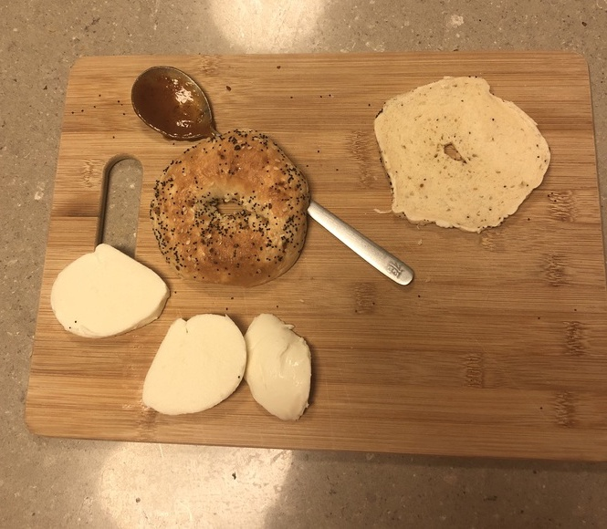
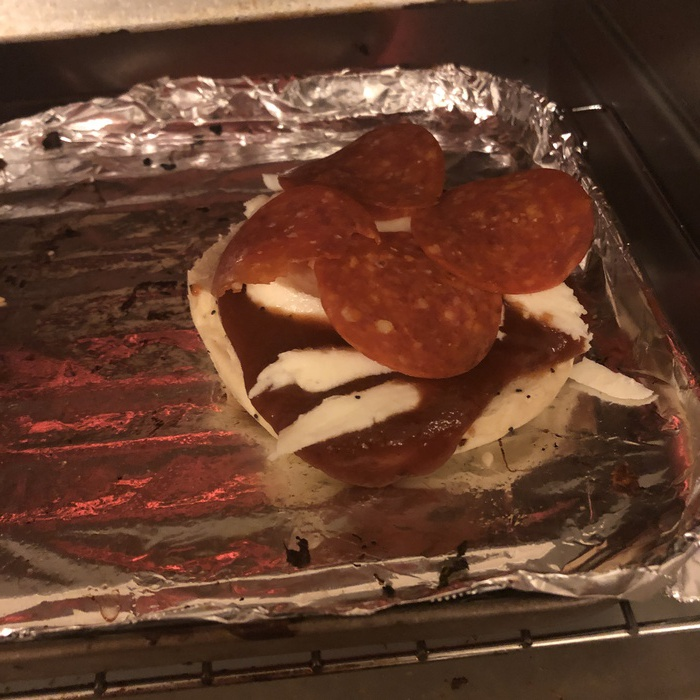

Everybody and their mother is talking about [Bagel Bites](https://en.wikipedia.org/wiki/Bagel_Bites) these days. I'm tired of it! Bagel Bites are overdone, overpriced, and they always underdeliver. Things like that have no place in a home pantry, let alone a grocery store aisle. Today the superior full-sized [Pizza Bagel](https://en.wikipedia.org/wiki/Pizza_bagel) ventures into our hearts and minds as the only legitimate bagel-based pizza spin off.

The pizza bagel, invented in the 1970s, adds an extra boost to the typical pizza crust. The precursor is of course pizza toast, a similar invention that uses a piece of toasted sliced bread in lieu of a bagel. Unfortunately, the porousness of typical sliced bread often leads to a floppy result, which is why these are not as common in the modern era. The pizza bagel improves on this design with less holes for sauce to seep through in the brief window before it is cooked, leading to a more structurally sound result. The other consideration is as follows: do you toast the bagel and add the pizza toppings? or do you add the pizza toppings and cook everything at once? The proper answer is the former, since the latter again leads to a soggy pizza, but this is okay to do if you are in a rush.

{{}}

All it takes is a few simple ingredients most people have in their home already. And the best part is a pizza oven is not necessary; since the bagels are already cooked, high heat is not essential to achieving a good outcome. Throw that baby in with some fresh pizza sauce, fresh mozzarella, and fresh pepperonis, and that's all you need to give Pizza Hut a run for their money! I prefer to broil my bagels rather than use the oven, since all we really need is some heat at the top.

{{}}

It takes more than a bite to eat, 11-13 is typical for me, but the taste and texture makes it well worth the investment over some crusty, slimy Bagel Bites. 
