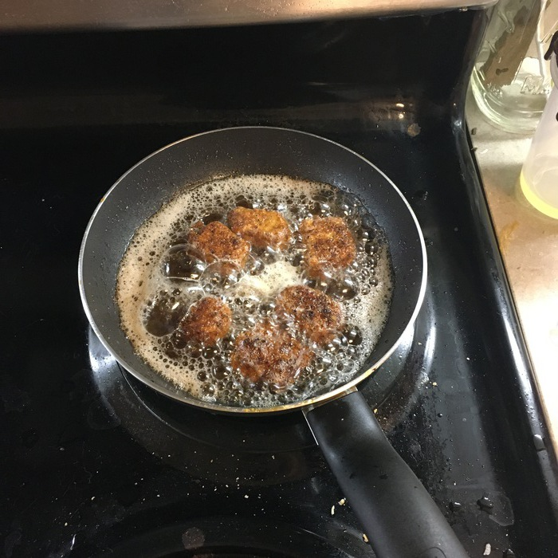
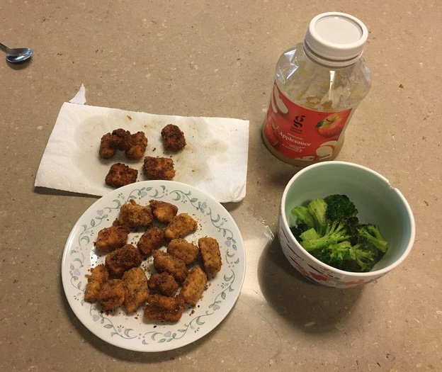

"Nugget" descends from the mid 1800s word "nug," which means lump. Gold, chicken, and even turkey have been shaped into nugget form, but until recent times, the general public has not accepted fish-based nuggets. Here we will consider salmon nuggets: salmon cut into small pieces with 90 degree angles, dipped in egg, flour, and breadcrumbs, and then fried.

You can bake a salmon, you can pan-sear a salmon, you can even eat it raw! But there is always room to spice things up a little, and here salmon nuggets fill that vacancy nicely. The closest relative to the salmon nugget is the fish stick. There are some crucial differences between the two, however. A fish stick is a far cry from a fish nugget, with one dimension dwarfing the others. A nugget is more equal on all axes, especially a salmon nugget which lends itself easily to a nugget with square angles. Secondly, fish sticks typically use white fish, a category which does not include salmon. While they may seem similar on the surface, a fish stick dish and a salmon nugget differ in many aspects.

{{}}

Since the fish is a little on the blander side of things, you could accompany it with ketchup or some other kind of dipping sauce. As always, it's important to follow the USDA's recommended food plate and get some fruits and vegetables to be with your salmon 'nugs. Here I have a smattering of broccoli along with some store-branch applesauce to complete the meal.

{{}}
