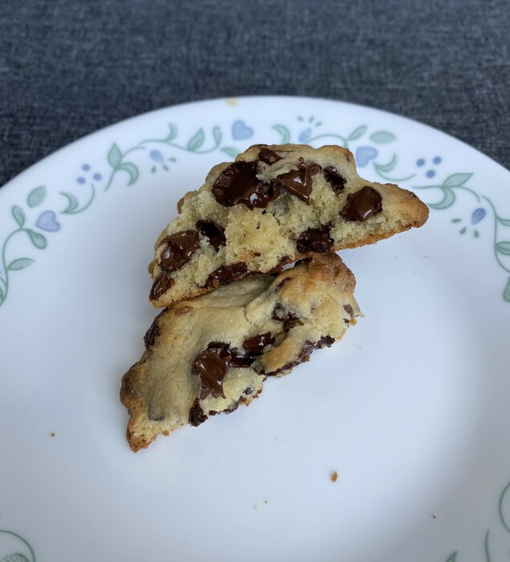

Not everyone has the resources, time, or fortitude to bake their own cookies. And sometimes, even with all that, that funny old thing called *life* can sometimes get in the way. Maybe these aren't the biggest cookies on the block, they'd certainly never win any competitions at a rural county fair, the kind where townsfolk come on by to show off who grew the largest corn that year. Instead these are an unassuming little subtitute that get the job done through strong fundamentals with a New England twist.

These cookies are of course the [Levain Bakery](https://levainbakery.com/) cookies that are sweeping the nation. From sea to shining sea, hungry consumers are pouring in droves to their local grocers to get their grubby mitts on their share of the tight supply of frozen cookies. Baked once at the cookie factory in the Big Apple (New York City), chilled for transport, these cookies are then ripe for a second round through the fire and flames in your local toaster oven.

{{}}

The cookies form a near semi-circle (a topic which [has been discussed](/cupcookies) before) that lends to some under-heating in the center. To be extra certain, a quick jab with your trusty meat thermometer should read somewhere in the neighborhood of 100°F before plating. Meat thermometer? More like cookie thermometer! And beware: those chocolate globs are no joke, you might take heed and use some gloves when handling the cookies, or a fork if you happen to have one on hand.

Imagine your standard, garden-variety cookie, but it's small and heavy on the butter and came frozen in a box, and you'd be pretty close to what these have to offer. They pack a punch for their size, but their diameter leaves a little bit to be desired. A more cube-shaped cookie would have been wise, as it would provide some interesting twists and turns in the mouth. But all in all, not too bad! I'll give it a nice, solid rating of: "it's alright."