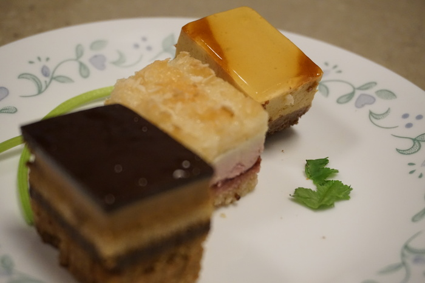
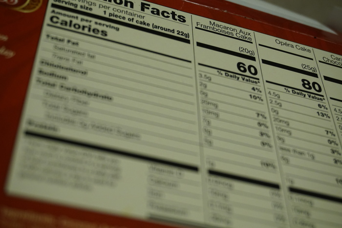

The Trader Joe's frozen dessert section draws a large crowd daily. People clamor for mochi ice cream, both miniature and regular sized in between swiping pints of esoteric ice cream flavors. So much to choose from! If only there was some collection of miniaturized desserts from which one could sample many types of desserts without committing to three pounds of cheesecake. Nestled in between the tiramisu and some kind of ice cream cone are the Sweet Bites, a packaged dessert that seems to solve this problem.

{{}}

But much like the forbidden fruit of Eden, once in hand the Sweet Bites are not so sweet after all. Three types of tiny cakes, what could go wrong? For starters, gone are the textural contrasts of cream and cake; the floppy bites are soggier than a Caribbean hurricane season. Downsizing the bites seems to have also downsized their flavor, the ratios simply don't work out to something palatable at this scale. A medium sized bite would have been more appropriate. Chicken nuggets face a similar dilemma: too small and the breading dominates, leading to a greasy, unfulfilling mess. Too big and the chicken nuggets become cumbersome, falling every which way and unapproachable for newcomers.

{{}}

Save yourself some trouble and skip over these the next time you’re in your local TJ’s. Instead, bite down one something more worthwhile like a refreshing glass of water or a bowl of peas.
