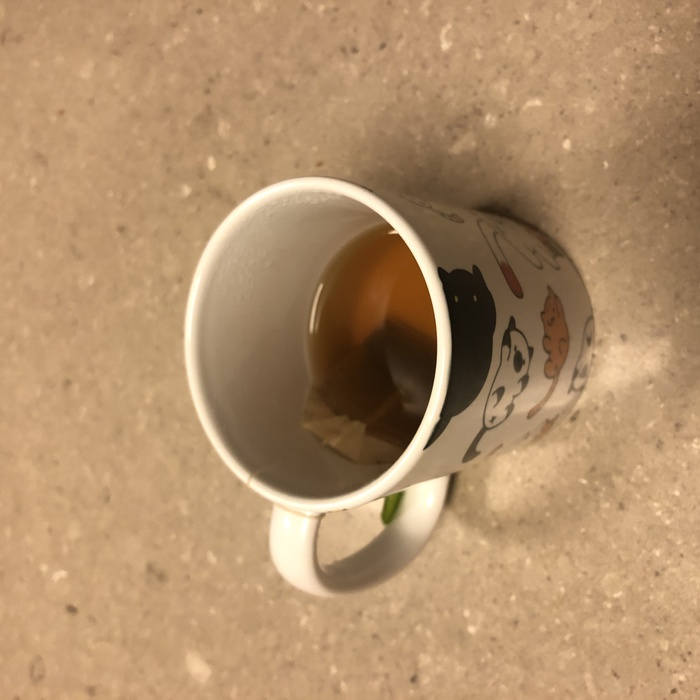
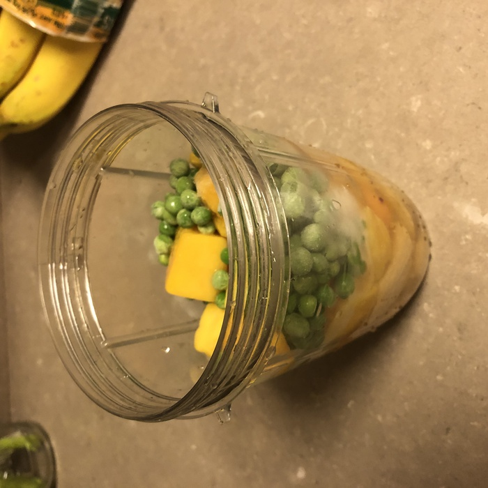

No, not toilet paper! While similar in that you may have a tough time finding peas at the market this time of year, the tea pea smoothie is far more satisfying! As any self-respecting "health nut" will be able to tell you, peas are the cornerstone of a hearty morning smoothie. I take this idea a step further, adding another power-food to the mix: tea. Used in the place of ordinary, run-of-the-mill water, the tea gives subtle earthy notes that accent the peas in a manner largely unknown to modern palates.

{{}}

This kind of thing has been done before, but never made it into the mainstream. Everyone has what is takes to make, some simple tea bags, frozen peas, maybe a banana or two. But rarely are people able to put two and two together to create a tea pea smoothie. To jump into uncertain waters certainly takes some aplomb, but hopefully this post is enough to push you, the reader, towards this end. Notice the slight brown tinge towards the bottom of the blender cup. 

{{}}

Health foods are all the rage these days, from gluten-free pizzas to kale omelettes, but there's no easier way to get the variety of nutrients required by the human body than a smooth, uniform smoothie. No pesky chewing required! Smoothies come in all shapes (though typically they are cup-shaped) and colors, but there are a few rules to keep in mind. For colors, there is an order of precedence between frozen fruits. Berries are at the top, even a single blackberry or strawberry will noticeably affect your smoothie color. Avoid berry mixes, as they lead to a muddled brown or purple, though using many of a single berry will often give a vibrant single color. Next come the peas, giving their trademark green to the mix. Lastly are the weak fruits, such as pineapple and mango, as well as the floppier vegetables, such as spinach and celery. As for shapes, this is much simpler. If everything is room temperature, you have nothing to worry about. However, if some of your smoothie is frozen, the outsides will heat first and liquefy. The frozen innards will then be affected by the buoyant force and pushed upwards, forming a frozen mound that sticks up from the surface. I don't know about you, but I don't like anything emerging from my foods! This is all advanced smoothie making though, so don't let it deter you from getting started.