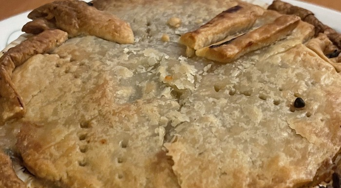

A twist on the classic "chicken and waffles," this Trader Joe's Frozen Chicken Pot Pie combines chicken and bread in a most unusual way. Suspended in a slurry of peas and carrots, a series of cubed, dense chicken bits float around. Don't think you can approach this guy with a fork, the viscosity of the innards is far too low for that. Hell, it's practically soup!

{{}}

Chicken and carbs hardly belong together, a shepherd's pie with its traditional beef filling creates a more cohesive experience. Chicken is essentially the bread of the animal world, so a chicken pot pie is bread inside bread except the inner bread is actually soup. The soup is not even thick, more watery than buttery. Perhaps someone needs to tell the food scientists over at Trader Joe's about roux or "gellants" so they could make their chicken pot pie a little more classic. Maybe a highlight of the general sliminess of this dish is the poppy-ness of the peas, which is saved by the lack of prior boiling on the peas.

Normally puff pastry can spice up any dish with a rich, buttery flakiness. But when that dish is damp as a Florida summer, the puff pastry cannot survive. The only time it comes up is on the edges, where it is practically burnt so there is no way for it to divorce it from its crunch. Trader Joe's is [well known](https://trends.google.com/trends/explore?geo=US&q=trader%20joes%20frozen%20food,safeway%20frozen%20food,kroger%20frozen%20food,Dick%27s%20Supermarket%20frozen%20food) around the United States, but there are far better options than this excuse for a chicken pot pie. If you're in the market for a personal chicken pot pie, you're probably stuck making it yourself.
