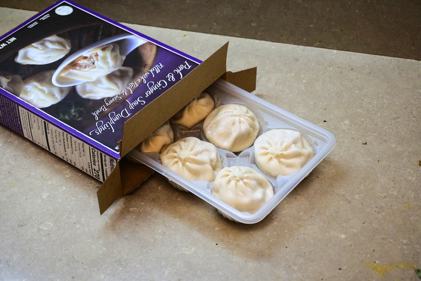
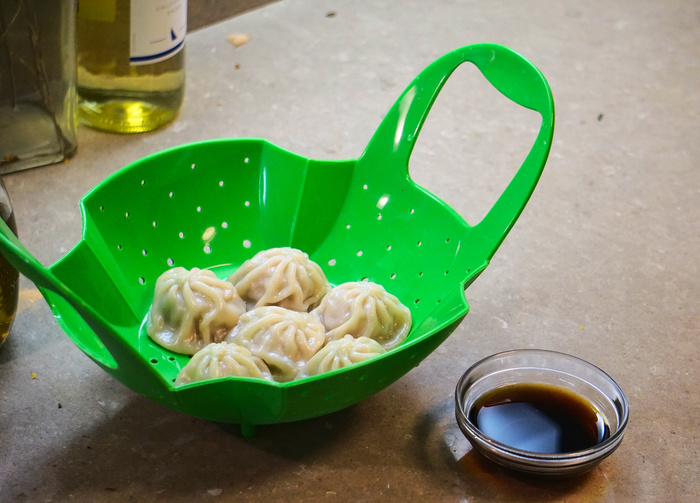

Soup? Inside a dumpling? You may think it impossible—nay, outrageous—to have a small serving of delicious soup delievered from the convenient shell of a dumpling inside a home kitchen, but the proof is right before your eyes! Questions abound, but one rises above the others: how do they get the soup in the dumpling? The answer is simple, bones! Surrounding the garden variety dumpling filling is a layer of aspic or a related gelatin. This melts when the dumpling gets steamed, forming from jello-like goo to a hearty soup. Try not to spill it all over the table!

{{}}

The soup dumpling or "Xiaolongbao" (commonly abbreivated as "XLB") can usually be found as standard dare in dim sum and specialty dumpling restaurants. I stood for minutes in shock, mouth agape, when I happened upon these frozen dumplings in my local Trader Joe's Frozen Food Aisle. They're a little on the smaller side (more like xiaoshortbao!) but they pack all the conventional ingredients. Their delicate skin presents a tricky challenge inside a home steamer, since they often slope inwards, leading the dumplings to come into contact with each other. It seems like no big deal from the outside, but picking up a stuck-on dumpling is a one-way ticket to a punctured dumpling skin! However, with extreme care a good experience can be had.

{{}}
