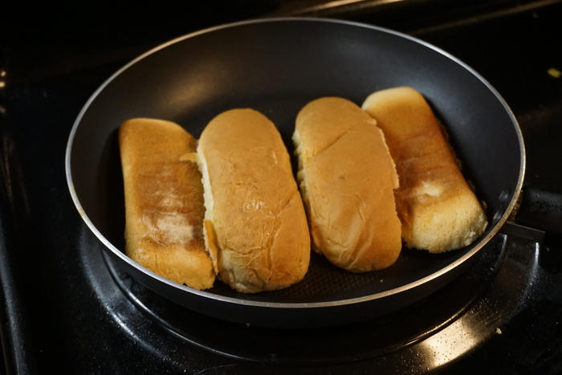
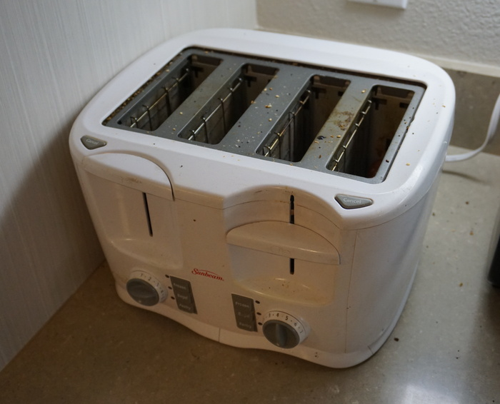
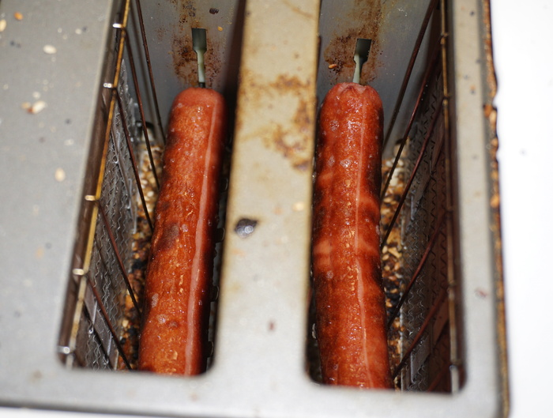
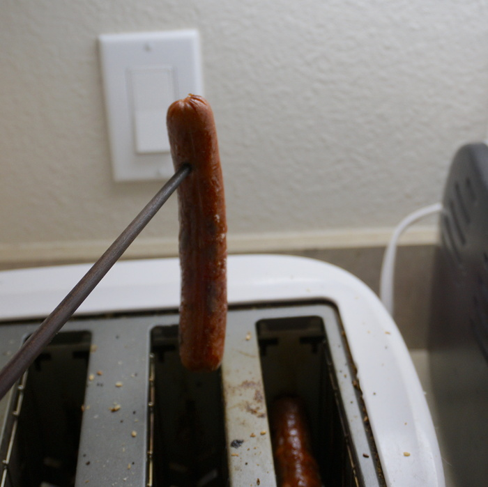

Tis' the season! For a delicious steaming hot dog that is! But it's too cold to grill outside in this climate, what does it take to get some dogs cooking over here? Fortunately I discovered long ago that a common kitchen appliance is more than apt for the task. I've lost count of the number of hot dogs I've toasted through the years, but it's probably in the low hundreds (mostly as a function of time, hot dogs are a special occasion for me and I'm not gobbling them down every day).



A standard hot dog presents a plethora of cooking options. In no particular order, one can: do nothing, boil, grill, pan fry, toast, microwave, and even indoor grill. Most store hot dogs are pre-cooked via a big hot dog steamer that gives them their taught and firm texture. So it's possible to chow down, but life is short and if you're rich enough to afford hot dogs, you can probably spend the extra time to elevate them a bit before eating. Among the low tier cooking methods microwave rates supreme for its ease of use and speed, but a hot dog plus a magnet doesn't sound very appetizing to me. Microwave dogs lose their firmness and sometimes deform into offensive shapes, but if you're desperate it's better than nothing. Boiling only works in very specific situations, like if you work at Costco. The simmering hot dog water potentially imbues some extra 'dog flavor, but it is doubtful that anyone is keeping a [perpetual stew](https://en.wikipedia.org/wiki/Perpetual_stew) of boiling hot dog water around to get the full body required. Pan frying a hot dog is effective but soulless and boring. Nothing beats a grilled dog in the end. The high heat makes those puppies sweat like nobodies' business and wraps them in a nice firm casing unachievable with the previously discussed methods.



But we're not here to talk about grillin'. If you're stuck inside during a harsh winter like me, the toaster unequivocally produces the best hot dogs. The heating elements emanate enough energy to kick the dogs along so they come out practically tasting grilled. While any toaster will do, some extra features make the toaster dogging experience a little easier, such as a removable tray or a 4-slot toaster, so you can make hot dogs for everyone at the party. Much like a well seasoned cast iron pan, toasting hot dogs pays dividends in the future. A coating of hot dog juice builds up on the interior of the toaster, nothing unsanitary, but enough to give your morning bagel a slight _hint_ of hot dog.



