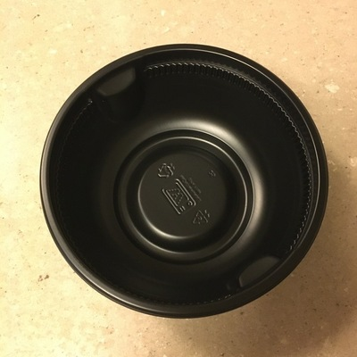
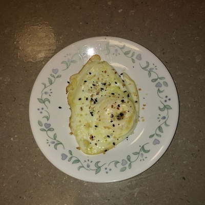

It can be tough these days to find a good Japanese soup restaurant. But fortunately, food science has progressed to the point where Japanese soups and noodle dishes can be made right in your own kitchen. Here we will consider the Nongshim Udon Bowl, which can be found on [walmart.com](https://www.walmart.com/ip/Nongshim-Fresh-Udon-Bowl-9-73-Oz-6-Ct/37204316) for $23.99. All you really need is a simple microwave, though at least 1000 watts of power is recommended.

Forget about the noodles and the soup for a minute, because you can't have soup without a bowl. The provided bowl is flimsy, but classier than your standard cup-noodles cup. It gets the job done, but not much more. The noodles themselves are quite thick, nearly 3 mm by my estimates. The wide rim lends itself better to scooping these noodles than a narrower rim would, so kudos to Nongshim for the foresight.

{{}}



The immediate comparison that jumps to mind with this dish is the Maruchan Instant Lunch Chicken Flavor or Nongshim "Cup Noodle" microwavable noodles. While the two are very different dishes, they fill a similar dietary niche. The broth on the udon noodles is much richer with a slightly oily tinge, and obviously the noodle diameter is bigger in the udon. One crucial aspect that you can't tell from the outside: the udon noodles come in a sealed package, slightly precooked. This contrasts with the rock hard noodle block that comes in a Cup Noodle. For those seeking a fancier option and can afford the luxury, I don't see any reason to ever choose a Cup Noodle style noodle dish over the udon.

Most would approach the cooked dish with a pair of chopsticks, but I opted to go with a fork for this one. With chopsticks, sure you can grab the noodles like nobody's business, but an average chopstick user will run into trouble grabbing the soup mix ins (the vegetable, seaweed, and tempura flecks). A fork fixes these problems handily, all the while effortlessly straining out the salty soup broth. If you must use chopsticks, I'd recommend keeping them as short as possible in order to attain maximum leverage, since those noodles can get heavy!

Slurping this soup lends a mildly fishy taste, a pleasant surprise in a microwaved noodle dish. If you're looking for some meaty body or chicken pieces like from a can of chicken soup, you won't find it here. It's noodles all the way to the end. But if you're looking for a hearty meal in a pinch, I rate this a "nice."

P.S. I know it's not traditional, but I like to blend cultures together. Here, I added an egg on the site, with some everything bagel seasoning on top. Don't listen to what the nay-sayers say, give it a try!

{{}}



