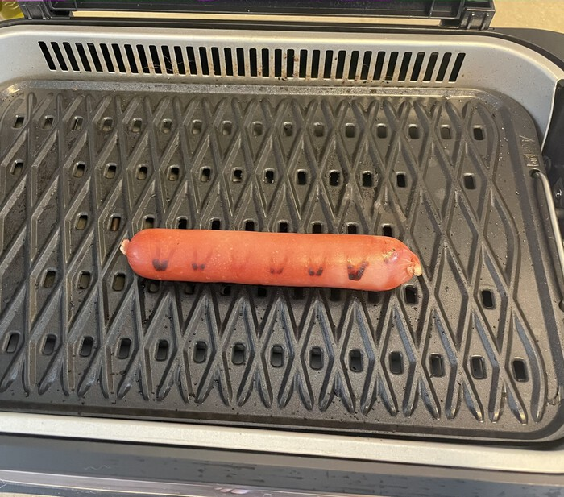
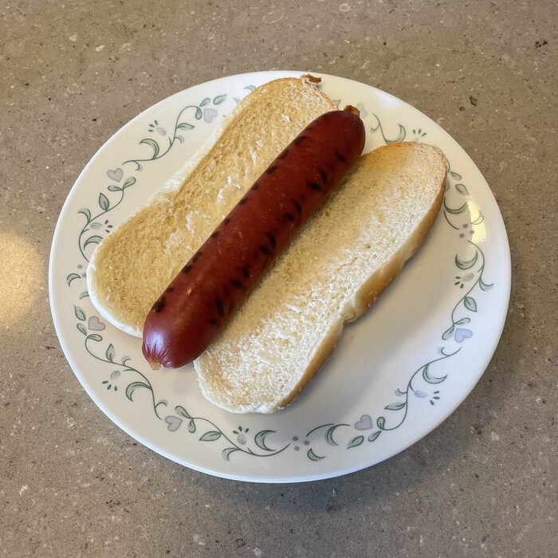

"Wagyu" in Japanese is 和牛 which means for "Japanese cow" which is where Wagyu beef comes from. Wagyu cows were invented in the old times, from a specialization of the East Asian aurochs that found their way across the sea. Noted for its flavors and marbling, Wagyu has become a household name across the entire contiguous United States. Ask anyone on the street, they might be able to name only a few breeds of cattle, Wagyu and Angus among them. Wagyu is typically rated as USDA "prime," as opposed to the less desirable ratings of "select" and "choice." The grocery store hot dog aisle has a similar three-tiered rating system that is less explicit. At the base level are the hot dogs with no source specified. Take a trip to the nutrition facts and a curious consumer will find a litany of ingredients ranging from pork to sodium nitrate. A step above are the dog packs that specify their meat, such as all-beef dogs or a turkey's dog. At the top tier are the bun-length all-beef Angus hot dogs. These babies can crack the $6 range but for a fancy dinner the investment is worth it.

All my life I thought that was all there was to the world of hot dogs, but a trip to the back corner of a grocery store recently changed all that when a pack of Wagyu hot dogs caught my eye. Thick and stout these dogs promised a great deal but ultimately failed to deliver, not only wasting my time but dashing my hopes for the future of innovation in the hot dog industry.

{{}}

Normally a hot dog's casing will get toasted and provide the classic hot dog "snap," but on these dogs the casing's thickness shot off the charts, so much so that the dog-juice generated during cooking had nowhere to go. A garden-variety hot dog will sweat a little once it heats up, but these dogs stayed bone-dry, steaming their innards with their juice vapors. This led to a hard to bite exterior filled with hot dog mush. And not the good kind of hot dog mush!

{{}}

It might look like a classic dog, but be warned: stick to the regular choices when it comes to buying hot dogs at the grocery.